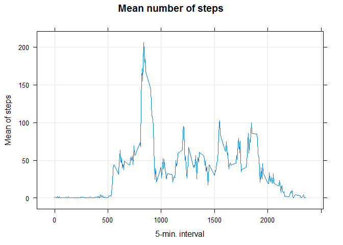
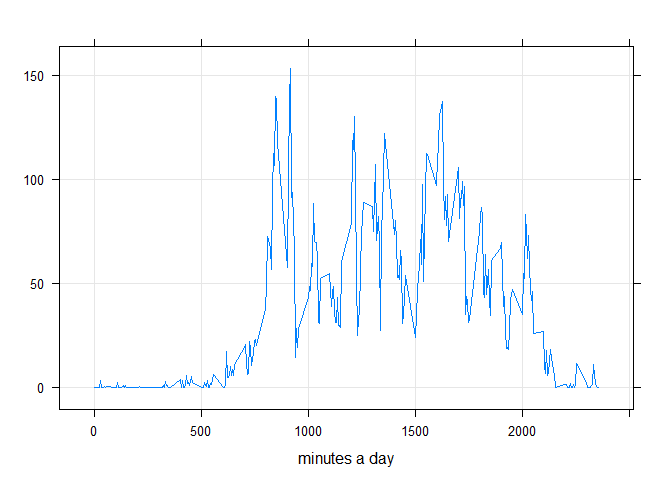
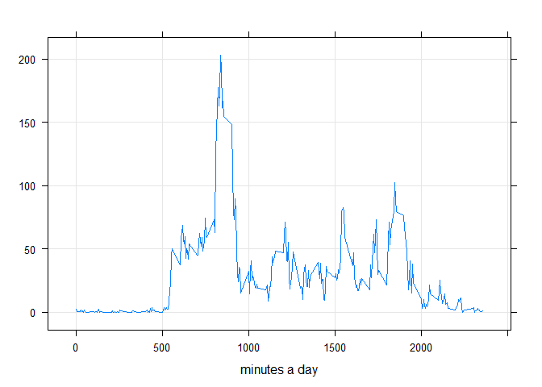

# Reprod.Research.Week2
Dennis Kerstens  
17 juli 2017  


```r
activity$date <- as.Date(activity$date, "%Y-%m-%d")
activity <- as.data.frame(activity)
```


```r
steps <- with(activity, tapply(steps, date, sum, na.rm = TRUE))
mean(steps)
```

```
## [1] 9354.23
```

```r
median(steps)
```

```
## [1] 10395
```


```r
meanint<- aggregate(x = activity$steps, by = list(activity$interval), FUN = mean, na.rm = TRUE)
names(meanint) <- c("interval","steps")
xyplot(steps ~ interval, data=meanint, type="l", grid=TRUE, ylab="Mean of steps", xlab="5-min. interval", main="Mean number of steps")
```

<!-- -->

```r
meanint[which.max(meanint$steps),c("interval")]
```

```
## [1] 835
```


```r
library(scales)
```

```
## Warning: package 'scales' was built under R version 3.3.2
```

```r
sum(is.na(activity))
```

```
## [1] 2304
```

```r
activity<-as.data.table(activity)
activity[is.na(steps), "steps"] <- activity[, c(lapply(.SD, median, na.rm = TRUE)), .SDcols = c("steps")]
```


```r
steps <- with(activity, tapply(steps, date, sum, na.rm = TRUE))
mean(steps)
```

```
## [1] 9354.23
```

```r
median(steps)
```

```
## [1] 10395
```


```r
Totalsteps <- activity[, c(lapply(.SD, sum, na.rm = FALSE)), .SDcols = c("steps"), by = .(date)] 
Totalsteps[, .(Mean_Steps = mean(steps), Median_Steps = median(steps))]
```

```
##    Mean_Steps Median_Steps
## 1:    9354.23        10395
```

```r
ggplot(Totalsteps, aes(x = steps)) + geom_histogram(fill = "blue", binwidth = 1000) + labs(title = "Daily Steps", x = "Steps", y = "Frequency")
```

<!-- -->


```r
activity <- mutate(activity, day = weekdays(activity$date))

weekdays <- c('maandag', 'dinsdag', 'woensdag', 'donderdag', 'vrijdag')

activity$day <- factor((weekdays(activity$date) %in% weekdays), 
         levels=c(FALSE, TRUE), labels=c('Weekend', 'Weekday'))
weekdays <- subset(activity, day == "Weekday")
weekends <- subset(activity, day == "Weekend")

weekendmeans <- with(weekends, tapply(steps, interval, mean))
weekdaymeans <- with(weekdays, tapply(steps, interval, mean))

xyplot(weekendmeans ~ interval, data=weekends, type="l", grid=TRUE, ylab="", xlab="minutes a day", main="")
```

<!-- -->

```r
xyplot(weekdaymeans ~ interval, data=weekdays, type="l", grid=TRUE, ylab="", xlab="minutes a day", main="")
```

<!-- -->

